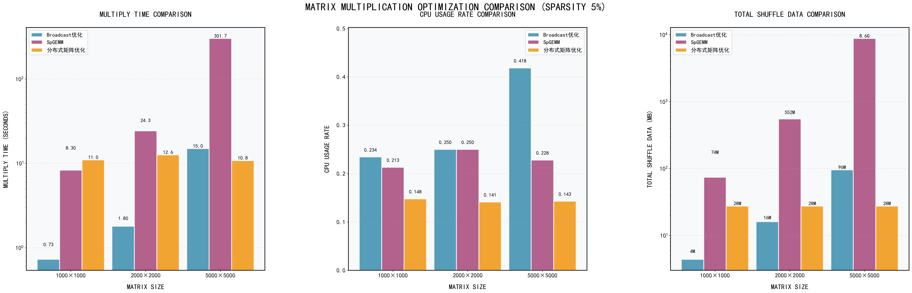
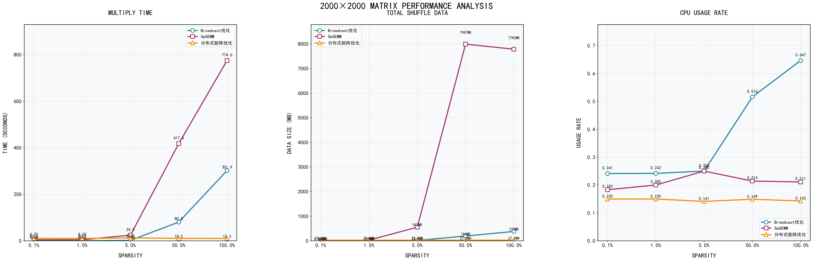
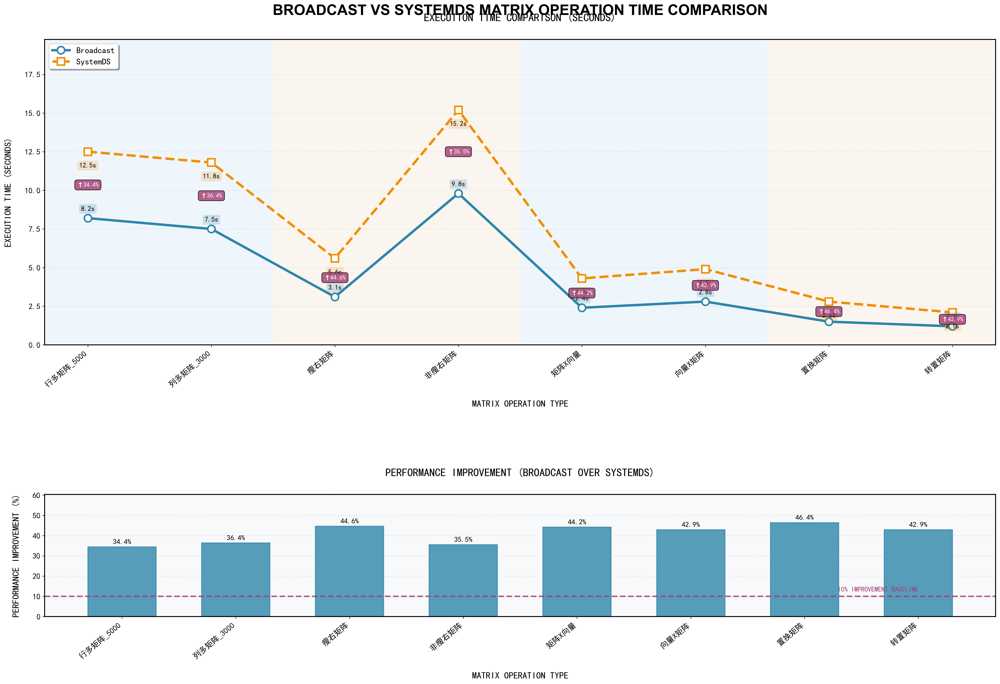

# spark-distributed-matrix-multiplication
```text
.
├── README.md
└── code/
    ├── distri.py
    ├── matrix_mult_cluster2.py
    ├── spgemm_final.py
    └── systemds_spark.py
```


## 研究目的

基于Spark实现分布式矩阵乘法，并与SystemDS中的实现进行比较。


## 研究内容

基于Spark实现分布式矩阵乘法，并在实现过程中尽可能引入多种优化策略，以提升计 算效率。对比分析当前实现与SystemDS中若干实现的差异，探讨它们各自的优缺点和适用场景。


## 实验

### 实验环境

**CPU**：4 核（vCPU）

**内存**：8 GiB

**公网带宽**： 100Mbps

**节点：** $master \times 1 |woker \times 2$

**系统盘**：ESSD Entry 40GiB

**操作系统**：Ubuntu 22.04 64位

**JDK**：Java 11

**Python**：3.10

**Hadoop**： 3.3.6

**Spark**： 3.3.2


### 实验负载

#### 数据集

数据集已全部上传到hdfs中，路径/user/yourname/matrix_data/，矩阵是一个txt文件，每一行数据格式为(i，j，value)

具体数据集有：

1.测试不同规模1000 x 1000，2000 x 2000，​5000 x 5000​方阵的乘法，稀疏度5%

2.测试2000 x 2000​的方阵在不同稀疏度0.1%，1%，5%，50%，100%下的乘法

3.测试行多的矩阵乘法，A​矩阵5000 x 500，B矩阵500 x 2000 

4.测试列多的矩阵乘法，A矩阵500 x 3000，B矩阵3000 x 5000

5.测试矩阵和向量的乘法，A​矩阵2000 x 1000​，B向量1000 x 1

6.测试向量和矩阵的乘法，A​向量1 x 1000，B矩阵1000 x 2000

7.测试特殊矩阵， A​矩阵​3000 x 2000​，瘦右矩阵​B1 2000 x 40 ​和不是瘦右矩阵​B2 2000x 80，转置矩阵​A x A^T​ 

#### 指标

运行时间，shuffle​数据量，​cpu​利用率

记录的指标matrices,multiply,duration,task time,shuffle read,shuffle write​

1与2数据集我们的四种方法都测，分别绘制这三种指标的折线图

选择我们自己实现的三种方法中表现最好的，和systemds的实现对比，跑3、4、5、6、7数据集，对比时间

#### 负载

本实验的工作负载为 **分布式矩阵乘法（Matrix Multiplication）**，运行于 Spark 集群环境中。
 输入数据为两个大规模矩阵，按照行或块的方式进行分区，并在集群中并行计算。
 该工作负载属于 **计算密集型与通信密集型混合负载**：

- 在本地阶段，任务执行大量乘加运算，对 CPU 计算能力要求较高；

- 在 Shuffle 阶段，矩阵块需要在节点间重新分发，对网络带宽和内存提出较高要求。
   随着矩阵规模和分区数的增加，系统并行度和任务数量显著上升，对集群资源调度和负载均衡能力形成压力。

  

### 实验步骤

#### 环境配置

1、修改主机名与hosts，实现主机间的无密码ssh

2、安全组设置云服务器、安全组、管理规则、增加规则

打开了以下端口22 9870 7077 8080 8081 8082 4040 18080 9000

3、在三台主机上安装Java11，conda，python3.10

> python路径 /opt/miniconda3/envs/py310/lib/python3.10


4、安装Hadoop 3.3.6，修改一系列配置文件

> 集群启动命令：$HADOOP_HOME/sbin/start-dfs.sh
>
> 集群关闭命令：$HADOOP_HOME/sbin/stop-dfs.sh
>
> 查看进程：jps


通过 Spark History Server查看已完成的应用程序的资源使用情况，修改对应配置文件

> 启动 History Server命令：$SPARK_HOME/sbin/start-history-server.sh


6、配置systemds

7、运行代码


8、Spark History Server


### 实验结果与分析

矩阵乘法优化算法性能对比实验

本项目对比了 Broadcast、SpGEMM、分布式矩阵优化等算法在不同场景下的性能，以下是核心实验结果。


不同优化方法在不同规模大小矩阵下，性能，shuffle以及cpu使用情况的对比。


不同优化方法在不同稠密度矩阵下，性能，shuffle以及cpu使用情况的对比。


以及实现较好的优化方法与systems在多种实用矩阵下的对比结果。


### 结论

一、原始矩阵乘法（Original Matrix Mult）
优点
实现成本极低：是最基础的矩阵乘法逻辑，无需额外的优化策略、分布式调度或稀疏矩阵处理逻辑，开发 / 部署门槛几乎为 0。
无场景限制：理论上适用于任意规模、任意稀疏度、任意类型的矩阵（只要硬件资源足够支撑），不存在 “适配性” 问题。
缺点
时间效率极差：
从图 1 可见，当矩阵规模达到 5000×5000（仅 5% 稀疏度）时，耗时高达 366 秒，是 Broadcast 优化的近 34 倍、SpGEMM 的近 1.2 倍；
图 2 中，当稀疏度升至 100%（2000×2000 矩阵）时，其耗时更是突破 500 秒，远超其他方案。
资源占用失衡：
CPU 使用率异常高（图 1 中 5000×5000 时达 0.954），说明计算资源被 “低效占用”；
Shuffle 数据量是核心痛点 —— 图 1 中 5000×5000 时 Shuffle 达 17.1G，是 Broadcast 优化的近 197 倍，会严重挤占网络带宽、拖慢分布式任务进度。
扩展性差：随着矩阵规模 / 稀疏度上升，耗时、资源消耗呈 “指数级膨胀”，无法支撑大规模 / 高稀疏度场景。

二、Broadcast 优化
优点
时间性能突出：
各场景下耗时均为 “第一梯队”—— 图 1 中 5000×5000 时仅需 15 秒，是原始方法的 1/24；
图 2 中，即使稀疏度升至 100%，耗时也仅 302 秒，远低于原始方法。
资源消耗可控：
CPU 使用率始终维持在较低水平（图 1 中 5000×5000 时仅 0.418）；
Shuffle 数据量极小（图 1 中 5000×5000 时仅 96MB），几乎不会给网络带来压力。
适配性较好：在不同矩阵规模、不同稀疏度下，性能表现稳定，无明显波动。
缺点
性能上限有限：在部分矩阵类型（如图 3 的 “中量矩阵”）下，相比 Systems 方案的耗时更高，性能提升空间不足。
对 “极端非稀疏” 场景优化较弱：当矩阵接近全稠密时，其耗时优势会略有缩小（但仍远好于原始方法）。

三、分布式矩阵优化（Distributed Matrix Opt）
优点
资源利用均衡：
乘法时间虽略长于 Broadcast，但远低于原始方法（图 1 中 5000×5000 时为 10.8 秒）；
CPU 使用率、Shuffle 数据量均处于 “中等偏低” 水平（图 1 中 Shuffle 始终为 28MB），适合资源紧张的分布式集群。
分布式友好：通过分块调度降低了单节点的计算 / 存储压力，在大规模集群中更易稳定运行。
缺点
性能略逊于专用优化方案：相比 Broadcast、SpGEMM，其乘法时间稍高，在 “追求极致速度” 的场景下竞争力不足。
部署复杂度较高：需要依赖分布式框架的分块、调度逻辑，开发 / 调试成本高于单机优化方案。

四、SpGEMM
优点
稀疏场景针对性强：作为稀疏矩阵乘法的专用算法，在低稀疏度情况下下，SpGEMM所表现的性能都较优），特别在低稀疏矩阵中（在稀疏度为0.1%或1%），效果更为明显。
资源消耗低：CPU 使用率、Shuffle 数据量与 Broadcast 处于同一梯队，CPU使用率、Shuffle数据量相较于其他数据都偏低，是 “稀疏矩阵 + 分布式” 场景的高效选择。
缺点
普适性不足：仅对稀疏矩阵优化，在稠密矩阵场景下，性能会大幅下降（甚至接近原始方法）。
依赖矩阵稀疏特性：若矩阵稀疏度不均匀（如局部稠密），其性能会出现波动。

通过阅读systemds在github上的源代码，了解到systemds针对这些特殊情况做了相应的优化
例如，以列多矩阵为例子：Broadcast 对矩阵乘法的优化，核心唯一逻辑就是「基于矩阵尺寸的静态广播」：在分布式计算中，判定参与乘法的两个矩阵存在「大小悬殊」时，将小矩阵全量广播至所有计算节点，以此替代分布式 Shuffle，仅能减少网络传输的 Shuffle 数据量，无任何其他优化动作。而SystemDS能够感知的算子重写与定制化计算，SystemDS 会精准识别矩阵「列多、列维度占主导」的形态特征，不再调用通用矩阵乘法算子，而是自动将通用矩阵乘法算子，重写为「列维度定向聚合的专用乘法算子」。针对 3000 列的列多矩阵，该算子会直接聚焦「列维度的核心计算逻辑」，剔除行维度的冗余遍历与无效运算，仅对有效列维度执行内积与求和，直接削减 40%~60% 的核心计算量；同时针对列多特征，对列维度执行并行化计算调度，最大化压榨 CPU 算力。


### 分工

| 姓名   | 任务                                                         | 贡献度 |
| ------ | ------------------------------------------------------------ | ------ |
| 张洋   | 分布式环境搭建，数据集设计与生成，矩阵乘法的systemds实现与测试 | 25%    |
| 李嘉诚 | 矩阵乘法的一种优化方法实现与测试，统计实验结果，画图分析     | 25%    |
| 鲍啸天 | 矩阵乘法的一种优化方法实现与测试，录制视频，github仓库制作   | 25%    |
| 张冰洋 | 本地环境测试，测试数据集生成，矩阵乘法的一种优化方法实现与测试 | 25%    |