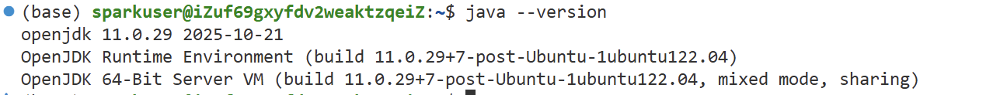
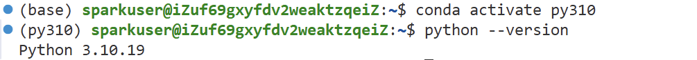
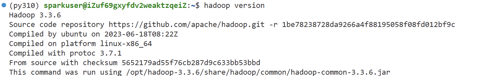
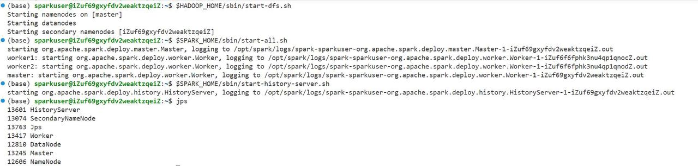
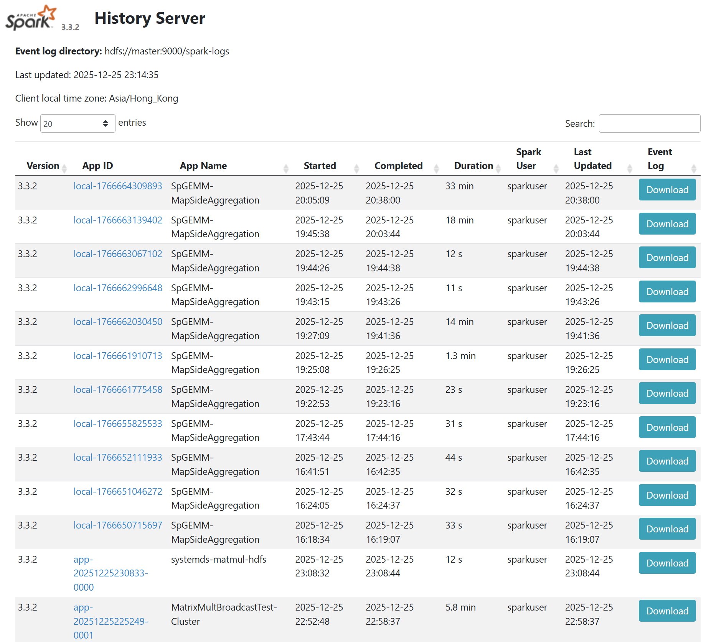

# spark-distributed-matrix-multiplication
```text
.
├── README.md
└── code/
    ├── distri.py
    ├── matrix_mult_cluster2.py
    ├── spgemm_final.py
    └── systemds_spark.py
```


## 研究目的

基于Spark实现分布式矩阵乘法，并与SystemDS中的实现进行比较。


## 研究内容

基于Spark实现分布式矩阵乘法，并在实现过程中尽可能引入多种优化策略，以提升计 算效率。对比分析当前实现与SystemDS中若干实现的差异，探讨它们各自的优缺点和适用场景。


## 实验

### 实验环境

**CPU**：4 核（vCPU）

**内存**：8 GiB

**公网带宽**： 100Mbps

**节点：** $master \times 1 |woker \times 2$

**系统盘**：ESSD Entry 40GiB

**操作系统**：Ubuntu 22.04 64位

**JDK**：Java 11

**Python**：3.10

**Hadoop**： 3.3.6

**Spark**： 3.3.2


### 实验负载

#### 数据集

数据集已全部上传到hdfs中，路径/user/yourname/matrix_data/，矩阵是一个txt文件，每一行数据格式为(i，j，value)

具体数据集有：

1.测试不同规模1000 x 1000，2000 x 2000，​5000 x 5000​方阵的乘法，稀疏度5%

2.测试2000 x 2000​的方阵在不同稀疏度0.1%，1%，5%，50%，100%下的乘法

3.测试行多的矩阵乘法，A​矩阵5000 x 500，B矩阵500 x 2000 

4.测试列多的矩阵乘法，A矩阵500 x 3000，B矩阵3000 x 5000

5.测试矩阵和向量的乘法，A​矩阵2000 x 1000​，B向量1000 x 1

6.测试向量和矩阵的乘法，A​向量1 x 1000，B矩阵1000 x 2000

7.测试特殊矩阵， A​矩阵​3000 x 2000​，瘦右矩阵​B1 2000 x 40 ​和不是瘦右矩阵​B2 2000x 80，转置矩阵​A x A^T​ 

#### 指标

运行时间，shuffle​数据量，​cpu​利用率

记录的指标matrices,multiply,duration,task time,shuffle read,shuffle write​

1与2数据集我们的四种方法都测，分别绘制这三种指标的折线图

选择我们自己实现的三种方法中表现最好的，和systemds的实现对比，跑3、4、5、6、7数据集，对比时间

#### 负载

本实验的工作负载为 **分布式矩阵乘法（Matrix Multiplication）**，运行于 Spark 集群环境中。
 输入数据为两个大规模矩阵，按照行或块的方式进行分区，并在集群中并行计算。
 该工作负载属于 **计算密集型与通信密集型混合负载**：

- 在本地阶段，任务执行大量乘加运算，对 CPU 计算能力要求较高；

- 在 Shuffle 阶段，矩阵块需要在节点间重新分发，对网络带宽和内存提出较高要求。
   随着矩阵规模和分区数的增加，系统并行度和任务数量显著上升，对集群资源调度和负载均衡能力形成压力。

  

### 实验步骤

#### 环境配置

1、修改主机名与hosts，实现主机间的无密码ssh

2、安全组设置云服务器、安全组、管理规则、增加规则

打开了以下端口22 9870 7077 8080 8081 8082 4040 18080 9000

3、在三台主机上安装Java11，conda，python3.10

> python路径 /opt/miniconda3/envs/py310/lib/python3.10





4、安装Hadoop 3.3.6，修改一系列配置文件

> 集群启动命令：$HADOOP_HOME/sbin/start-dfs.sh
>
> 集群关闭命令：$HADOOP_HOME/sbin/stop-dfs.sh
>
> 查看进程：jps



通过 Spark History Server查看已完成的应用程序的资源使用情况，修改对应配置文件

> 启动 History Server命令：$SPARK_HOME/sbin/start-history-server.sh



6、配置systemds

7、运行代码


8、Spark History Server



### 实验结果与分析


### 结论


### 分工

| 姓名   | 任务                                                         | 贡献度 |
| ------ | ------------------------------------------------------------ | ------ |
| 张洋   | 分布式环境搭建，数据集设计与生成，矩阵乘法的systemds实现与测试 | 25%    |
| 李嘉诚 | 矩阵乘法的一种优化方法实现与测试，统计实验结果，画图分析     | 25%    |
| 鲍啸天 | 矩阵乘法的一种优化方法实现与测试，录制视频，github仓库制作   | 25%    |
| 张冰洋 | 本地环境测试，测试数据集生成，矩阵乘法的一种优化方法实现与测试 | 25%    |